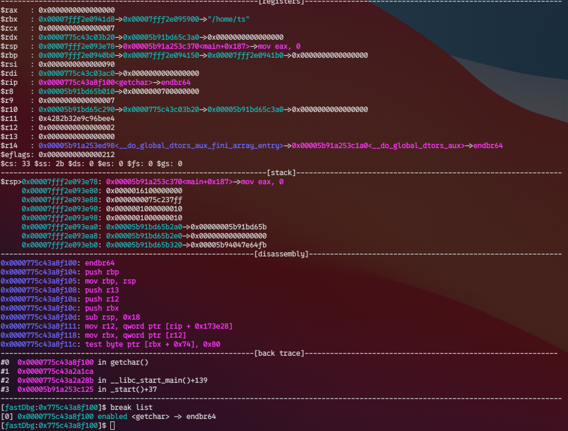

# break

set breakpoint

## break

break at address

syntax: `break <address>`
syntax: `b <address>`

## break pie

break at address+pie base

syntax: `break pie <address>`
syntax: `b pie <address>`

## break list

syntax: `b list`
